# How to use this Automated AI investment approvals solution

## Summary

This solution is a Power Automate workflow which runs on a Outlook mailbox. It runs on specific emails with attachments. It goes into the attachments using AI (using Azure OpenAI and AI Builder) and based on the information in the Risk analysis supplied in the email it starts an approval or auto approves the given investment.

## Use cases
- Employees fill in two document templates to describe their need and describe risks.
- These files can be send to a mailbox or uploaded to a SharePoint Document library.
- This will start our Power Automate flow which will process the documents and asses risks
- If there are high risks an email (Teams approval) will be send to the Approver(s) including:
  - Just the high risks (containing the risk description, probability, severity and description how to mitigate the risk)
  - A summary of the business case
- If there are no high risks an email (Teams approval) will be send to the Approver(s) to inform then the request is auto approved. This message will includes a summary of the request and will include the original documents.

This application illustrates the use of the Power Platform (Power Automate) in combination with AI (AI Builder and Azure OpenAI) to automate and help during approval scenarios. Azure OpenAI lets you build ntelligent apps with AI models on your own data.

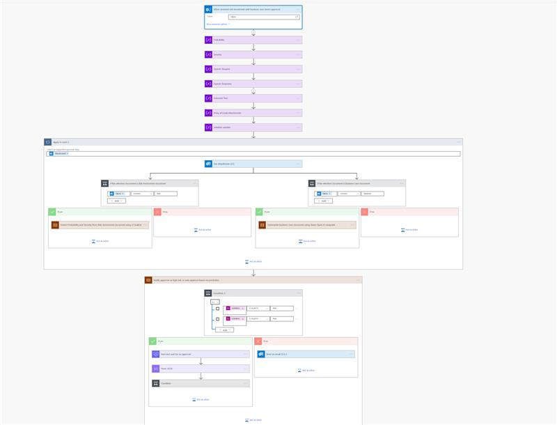
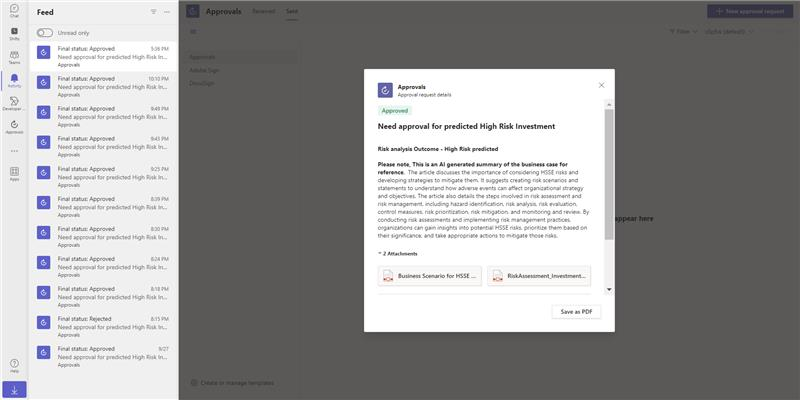
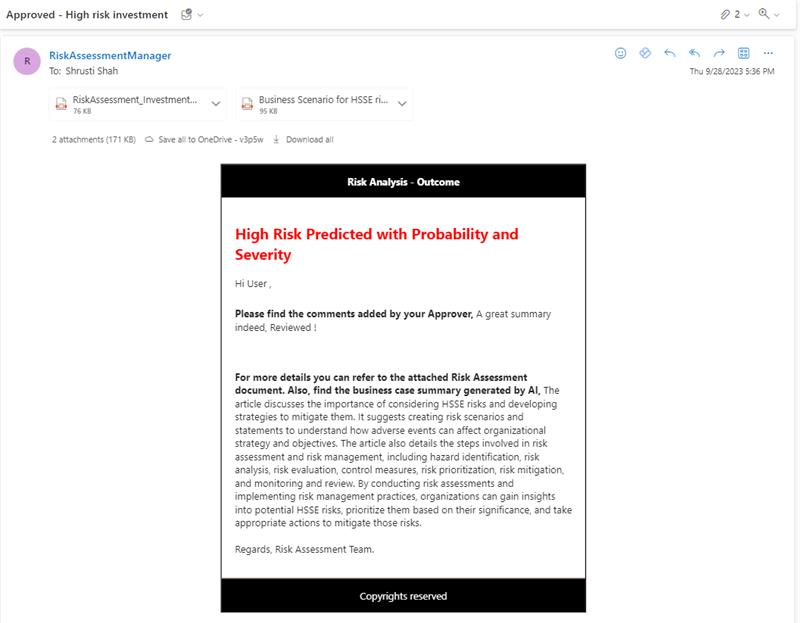

## The Problem Statement
Internal approval processes can often be slow due to a variety of factors and bottlenecks within an organization. The most common reason are: Complexity of decision-making, bureaucracy,  communication challenges, overloaded Decision-Makers and inadequate resources.

So this is clearly an area where automation and AI can play an amazing role for creating more agile organisations!

In the past two decades Microsoft technology like SharePoint, InfoPath and third party workflows solutions have helped organisations to automated approval processes, like internal purchasing. In the last couple of years technology like Power Automate and the Teams Approval App have added more functionality. And although these technology have improved system flexibility and user-friendliness, the organisational bottlenecks still exist…

**So. Here our HACK!**
Our AI driven Power Platform solution will lower the number of bottlenecks, by supporting decision-makers in making decisions more quickly, and in certain situations, completely removing the need to ask a human to make a decision! For many operational and tactical decisions, Machine Learning is able to do a much better and consistent job, compared to most (overloaded) decision makers!

For some processes it would be wise to have somebody other than the requestor (a Subject Matter Expert) to validate and improve the risk assessment form before it is sent for approval. This will result in data accuracy and better (automated) decisions.

Automating approval steps in financial (CAPEX) investment processes or change requests for Change Advisory Boards, will help organisations to move much faster. It will allow employees to focus on the things that really matter, like discussion how to best mitigate high risks or finding alternative solutions for certain business. Let’s run more operational processes on business logic!

## Prerequisites

- A custom trained document processing model (contained in the solution)
- Power Platform Dataverse environment
- Azure Open AI service (US region) with Chat completion endpoint and API Key
- Valid license and permission to use Office 365 Outlook and Teams Approval 

## Version history

Version|Date|Author|Comments
-------|----|----|--------
1.0|September 28, 2023|Robert Schouten|First release of the Automated-AI-Investment-Approvals solution

## Disclaimer

**THIS CODE IS PROVIDED *AS IS* WITHOUT WARRANTY OF ANY KIND, EITHER EXPRESS OR IMPLIED, INCLUDING ANY IMPLIED WARRANTIES OF FITNESS FOR A PARTICULAR PURPOSE, MERCHANTABILITY, OR NON-INFRINGEMENT.**

---

## This demo illustrates

- Use of Power Automate
- Use of AI Builder to extract text from PDF document
- Use of AI Builder to extract information from document using a custom trained document processing model
- Use of Azure OpenAI
- Use of Custom Connector to Azure OpenAI

## Install the solution in Power Platform

### Create an Azure OpenAI Resource

Follow the instructions to [create a Azure OpenAI Resource](https://learn.microsoft.com/en-us/azure/ai-services/openai/how-to/create-resource?pivots=web-portal). 
Make sure you'll create the resource in a US region.

### Import the Power Platform Solution into your environment

- Import the [Solution](solution.zip) into your environment

  The solution contains the following components:
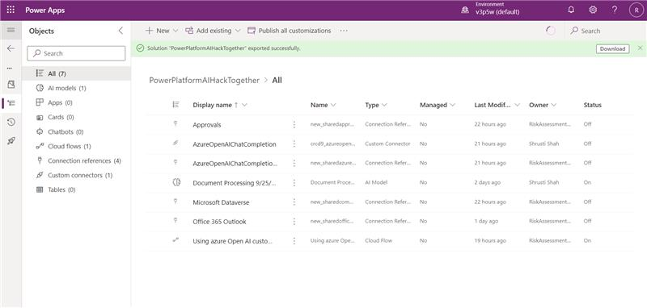

Import solution:

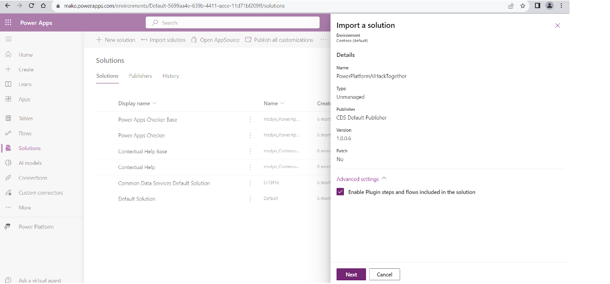
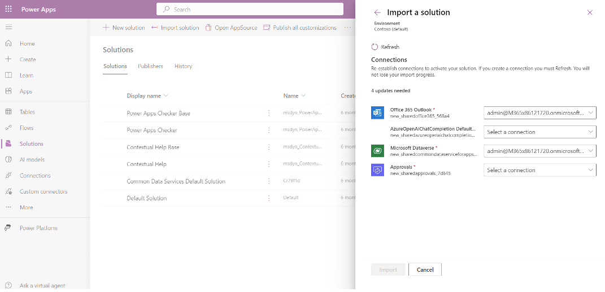
All the connectors should have the connections of Risk Manager and where there is no connection, create new connection

- Fix the connections and walk through the Power Automate Flow and change the settings like below:

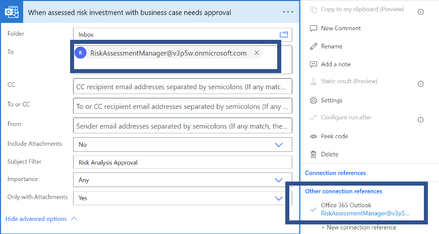
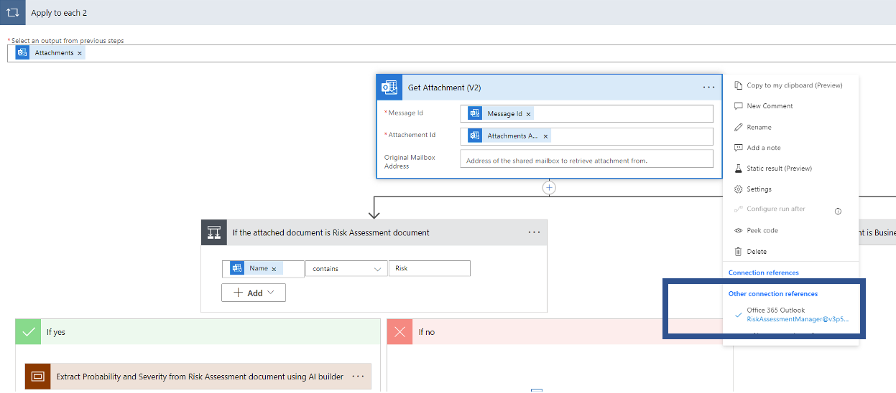
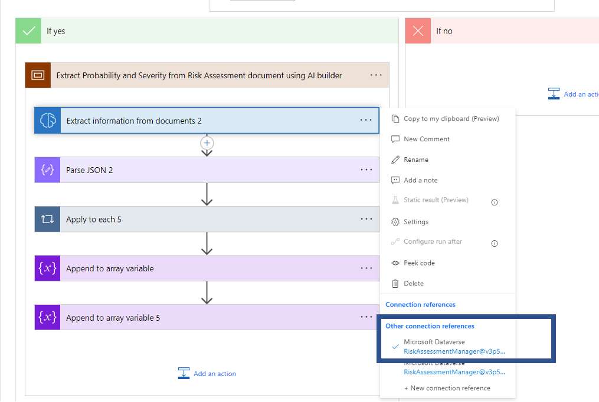
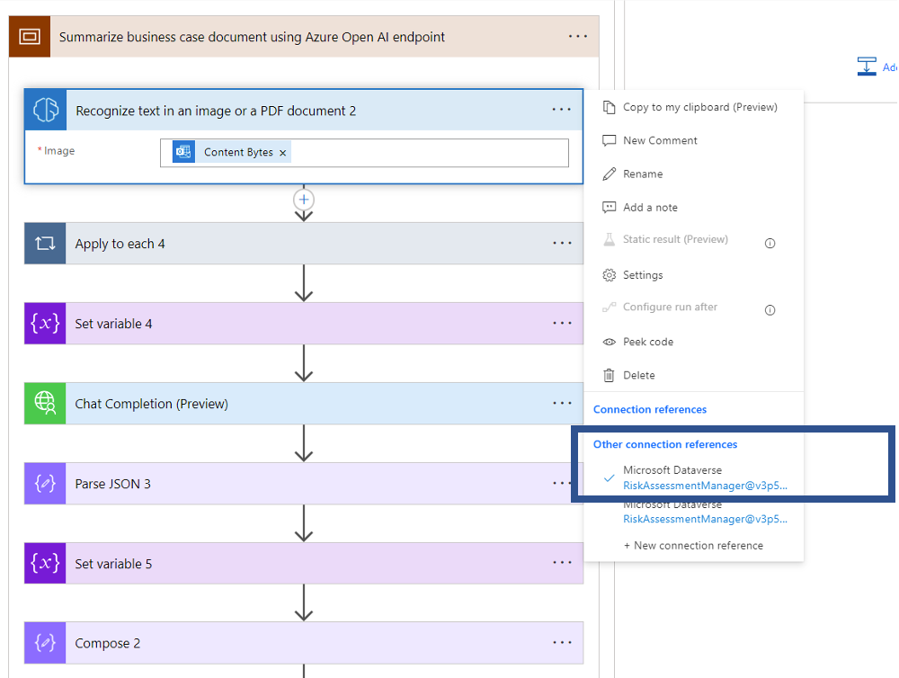
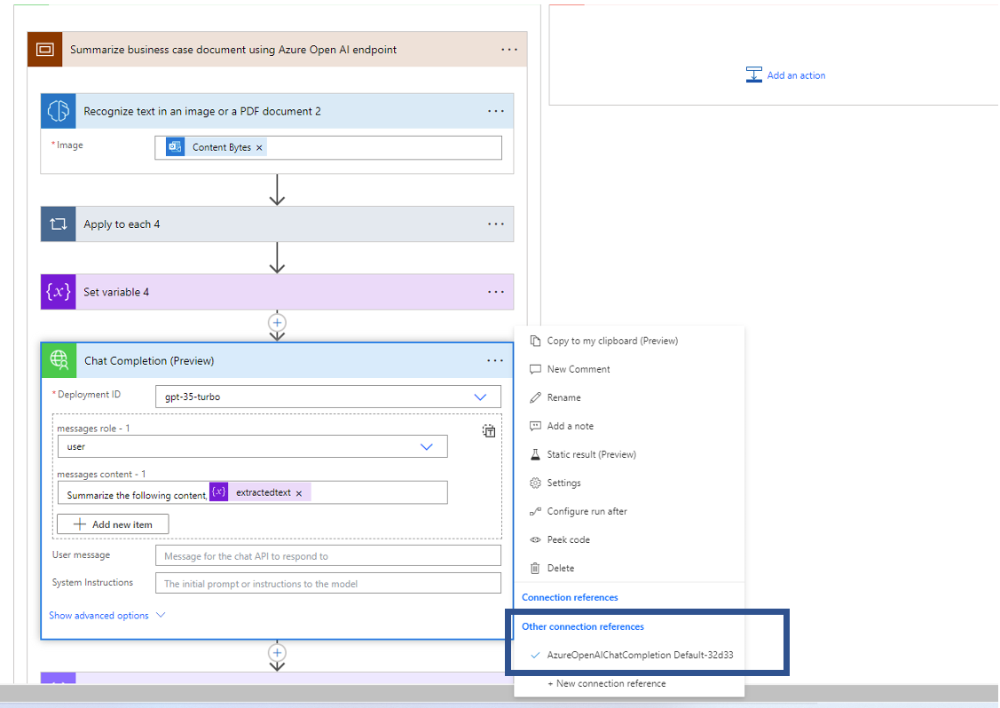
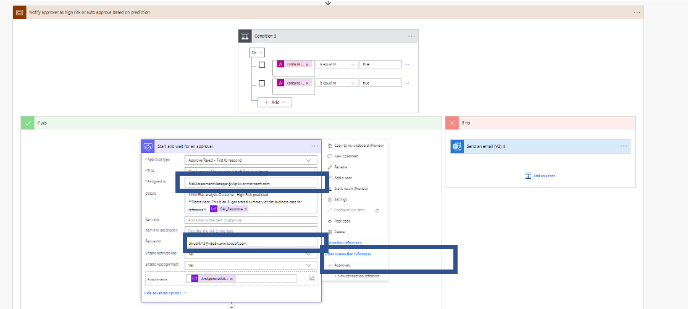
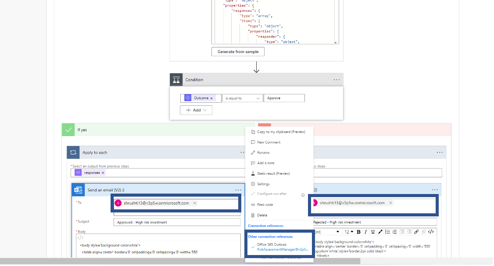
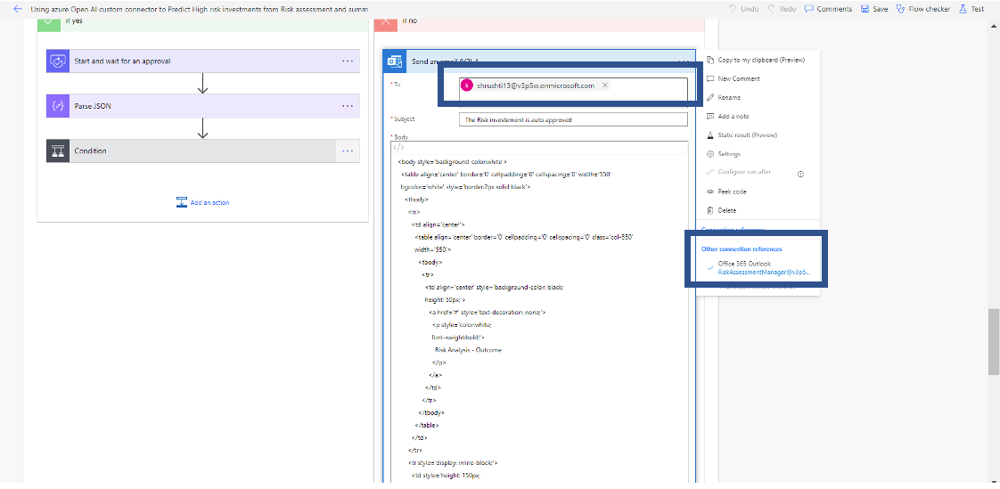

### Send email to your mailbox

After you have completed the provision and deploy steps in `Install the solution in Power Platform` section, you can send an email to your configured mailbox with the following information:

- Subject: xxx
- 2 attachments with in its name 'Risk' and 'Business case'
